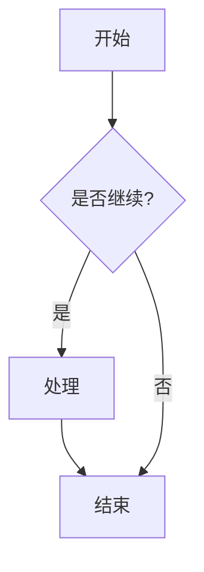

# 一级标题示例

这是一段正文文本，使用了 Merriweather 字体，字号为 18px，行高 1.6。这个设置优化了长文阅读体验。

## 二级标题示例

下面展示各种Callout类型：

### 标准Callout

> [!info] 信息提示
> 这是一个信息类型的callout，用于提供一般性信息。

> [!warning] 警告
> 这是一个警告提示，提醒用户注意潜在问题。

> [!error] 错误
> 这是一个错误提示，表示严重问题。

> [!success] 成功
> 这是一个成功提示，表示操作成功完成。

### 扩展Callout类型

> [!garden] 种植提示
> 这是一个garden类型的callout，使用🌱图标。

> [!tip] 小贴士
> 这是一个tip类型的callout，使用💡图标。

> [!example] 示例
> 这是一个example类型的callout，使用📗图标。

> [!remark] 重要备注
> 这是一个remark类型的callout，使用❗️图标。

> [!question] 问题
> 这是一个question类型的callout，使用❓图标。

> [!important] 重要
> 这是一个important类型的callout，使用⭐️图标。

> [!other] 其他
> 这是一个other类型的callout，使用📎图标。

> [!todo] 待办事项
> 这是一个todo类型的callout，使用✅图标。

## 代码块测试

### 内联代码

这是一个`内联代码`示例，应该有浅灰色背景和圆角。

### 代码块

```javascript
function greeting(name) {
  console.log(`Hello, ${name}!`);
  return {
    message: `Welcome to our digital garden`,
    timestamp: new Date()
  };
}

// 调用示例
greeting('World');
```

```python
def fibonacci(n):
    """计算斐波那契数列"""
    if n <= 1:
        return n
    return fibonacci(n-1) + fibonacci(n-2)

# 打印前10个斐波那契数
for i in range(10):
    print(fibonacci(i))
```

### Mermaid图表



## 列表测试

### 无序列表

- 第一项
- 第二项
  - 嵌套项目
  - 另一个嵌套项
- 第三项

### 有序列表

1. 第一步
2. 第二步
3. 第三步

### 任务列表

- [ ] 未完成任务
- [ ] 另一个未完成任务
- [x] 已完成任务
- [x] 另一个已完成任务

## 链接测试

这是一个[内部链接](/notes/README)示例，下划线应该更细（1px），悬停时变粗。

这是一个[外部链接](https://example.com)，应该有相同的样式效果。

## 引用测试

> 这是一段引用文本，应该有左边框和斜体效果。
>
> 引用可以包含多个段落。

## 三级标题测试

三级标题使用了次要文本颜色，提供更好的层次感。

### 四级标题测试

四级标题字重更轻，适合更深层次的内容组织。

## 表格测试

| 特性 | 优化前 | 优化后 |
|------|--------|--------|
| 基础字号 | 16px | 18px |
| 内容宽度 | 960px | 900px |
| Callout类型 | 4种 | 8种+ |
| 字体 | sans-serif | Merriweather |

---

水平线用于内容分隔，上方应该有适当的间距。
